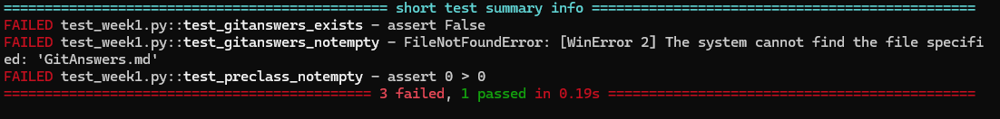
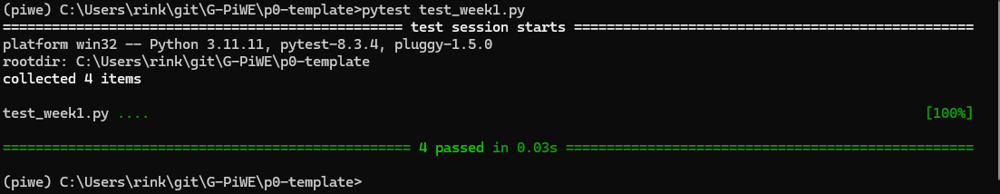

# PiWE Week 1: Course introduction and git/GitHub

TA office hours: Mondays and Wednesdays from 13:00 to 14:30.

Slides: in this folder.

## Git: Distributed Version Management

Collaborate on code and make it run on several different machines while still keeping track of the
version history. This week, you will practice important workflows that are essential for developing and
collaborating on code.

## Homework due next week

These instructions, with intention, do not spell out every step for you. This is because a good portion
of scientific programming is finding/utilizing tutorials and guides online. We also expect you to
collaborate with your group members and, of course, post in the Slack chat or come to office hours as needed.
You are done at the end of Part 3, when all tests pass.

### PART 1: With P0 Team, in class

1. If you are the only person in your P0 Team, talk to Jenni to get reassigned.  
2. ONE person from your group:  
   * Under Learn / Content / Administration, click the link for the GitHub Assignment for Weeks 1 and 2.  
   * When prompted, create a new team. Call your team "Team X", where "X" is replaced with your Team number (e.g, "Team 42").  
   * If you are asked to link your GitHub account to a "student identifier", the identifier should be your student ID or DTU username.  
3. Other group members should now click the same link on Learn for the GitHub assignment BUT join the existing team, "Team X".  
   * If you are asked to link your GitHub account to a "student identifier", the identifier should be your student ID or DTU username.  
4. Everyone clones the new team repo locally to their computer.  
5. Discuss with your team:  
   * Who should answer which questions in "Git questions", which is part of Part 3.  
   * If you will complete Part 2 together or individually.  
   * When you will meet to complete Part 3 and whether you will meet physically or virtually.  
6. Move onto the next part.

### PART 2: Individually or with your team

Each person should complete the following steps. We recommend working with a buddy or your P0
team, but each person must push a branch with their code.

1. Run the week1 test, which should FAIL for now:  
    * Open Anaconda prompt.  
    * Install `pytest`: `pip install pytest`
    * Change directory to your team repo.  
    * Run pytest on the week1 test: `pytest test_week1.py`.  
    * There should be some white and red text and notes about failures, like this:  
        
2. If you are not familiar with using git/GitHub, watch the five git/GitHub introduction videos [here on Panopto](https://panopto.dtu.dk/Panopto/Pages/Sessions/List.aspx?folderID=de5b944f-9e31-4b2d-8477-b27a00f792db).  
3. Create a new branch in your group repository, named after you. (Related links in "Videos and tutorials" below.)  
4. Create a folder called `preclass_assignment` in the top level of the repo. In this folder, place your solution to the preparatory Python exercises you completed before Week 1.
5. Add/commit your code to the branch.
6. Push your branch to GitHub.  

### PART 3: Together with your P0 Team

This should be done together with your team. Your team can meet physically, virtually or hybrid as you prefer.

1. Pull the branches of other teammates locally, or view the branches online. (Related links in "Videos and tutorials".)  
2. Present your code to each other and compare how you solved the preparatory exercises.  
3. Decide which branch you want to merge into main.  
4. On GitHub, one person creates a pull request (PR) to merge the chosen branch into `main`.  
5. Another person reviews the PR (links in "Videos and tutorials") and, if it looks okay, accepts it.  
6. All group members update their local copies of `main` branch.  
    * Hint: the steps are to switch into the main branch, then pull.  
8. Create a text file called `GitAnswers.md` in the top level of the repo, add your answers to the
   the git questions below, and push it.  
    * (Optional) Have each person push their answers to their own branches, then sequentially merge each
      set of answers into main. This will probably create merge conflicts (link in "Videos and
      tutorials"), and it's good to practice handling those in a low-stakes situtation.
10. Run the week1 test again (instructions above).
    * If you get a set of green dots and green text that says 4 passed, like below, you're done! Great work!  

## Git questions to answer

In `GitAnswers.md`, write 1 to 2 sentences to answer each of the following
questions.  (Note that for question 6 you will need to also push an image.)

1.	What is the difference between git and GitLab?  
2.	What is the difference between GitLab, GitHub, and BitBucket?  
3.	Why would I ever want to use git, but not GitLab?  
4.	What are the steps to update the GitLab server with some changes I made on my computer?  
5.	What is a branch and why would I use one?  
6.	How could you visualize a branch with 3 commits, and then another branch that breaks off after the second commit and has a single commit?  
7.	Give an example of a set of git commands that would result in a merge conflict.  
8.	Is Git suitable for latex documents?  
9.	Should I from now on version my word and powerpoint slides using git? Why/why not?  
10.	What could happen when I push my latest commit to the remote repository without pulling first?  
11.	What happens when I pull without commiting my local changes first?  
12.	What is the difference between branching and forking?

## Videos, tutorials, and cheatsheets

### Recommended

 * [Git Basics video series with Ju Feng and Jenni](https://panopto.dtu.dk/Panopto/Pages/Sessions/List.aspx?folderID=de5b944f-9e31-4b2d-8477-b27a00f792db)  
   5 videos both explaining theory and showing livecoding
 * [(Video) Atlassian tutorial on branches](https://www.atlassian.com/git/tutorials/using-branches).  
   Very nice, in-depth tutoprial on what branches are and how to use them.
 * [Git cheat sheet](https://education.github.com/git-cheat-sheet-education.pdf)  
   A good reference of the most common commands

### Extra resources

 * [Video: Cloning, pushing and pulling by Jenni](https://panopto.dtu.dk/Panopto/Pages/Viewer.aspx?id=49668227-45c1-48ee-bc99-b1070104253e).  
   A quick demo of cloning, pushing and pulling.
 * [Video: Introduction to git and GitLab by Jenni](https://panopto.dtu.dk/Panopto/Pages/Viewer.aspx?id=531326d3-6572-4b7b-8273-af9b00bd5cfe).  
   Review of basic commands, but also mentions branching and merging, gitignores, READMEs, etc.
 * [Detailed slides from Kai Heussen on git](https://github.com/DTUWindEducation/46120-PiWE/tree/main/week01_intro_git/KaiHeussen_GitWorkshop.pdf).  
   Background on git/GitLab but also a lot of examples of git terminal commands.
 * [GitHub docs on pull requests](https://docs.github.com/en/pull-requests/collaborating-with-pull-requests/proposing-changes-to-your-work-with-pull-requests/about-pull-requests).  
 * [GitHub tutorial on how to review pull requests](https://docs.github.com/en/pull-requests/collaborating-with-pull-requests/reviewing-changes-in-pull-requests/reviewing-proposed-changes-in-a-pull-request).  
 * [Atlassian tutorial on add/commit/stash/gitignore](https://www.atlassian.com/git/tutorials/saving-changes)
 * [Atlassian tutorial on merge conflicts](https://www.atlassian.com/git/tutorials/using-branches/merge-conflicts)
